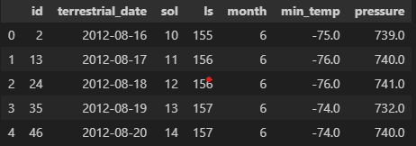

# Module-11-web-scraping Challenge
---------------------------------------------------------------

## Description
This challenge puts to the test the ***Web-Scraping*** skills I've learned in the 11th Module-Data Collection of the Carelton Data Analytics Boot Camp. Such new skills as identifying *HTML* elements and their *id* and *class*  attributes. Extracting information with automated browsing with *Splinter* and *HTML parsing* with ***Beautiful Soup***, the new Python Library introduced this week for efficient Web-Scraping. This challenge continues on from the core skills learned such as organizing and storing data, analyzing data, and then visually communicating your insights with an extra emphasis on the first step ***Data Collection***.

## Table of Contents

- [About](#about)
- [Getting Started & Installing](#getting-started--installing)
- [Usage](#usage)
- [Contributing](#contributing)

## About
As described above, in this challenge I had to scrape the data from two websites, [Mars News Site](https://static.bc-edx.com/data/web/mars_news/index.html) & [Mars Temperature Data Site](https://static.bc-edx.com/data/web/mars_facts/temperature.html). <br>
**Part 1** of the challenge covers the Mars News Site, where I needed to extract the title and preview text elements and finally store them in a clean, easily read JSON dictionary format, e.g.: <br>
```
{'title': "10 Years Since Landing, NASA's Curiosity Mars Rover Still Has Drive",
  'preview': 'Despite signs of wear, the intrepid spacecraft is about to start an exciting new chapter of its mission as it climbs a Martian mountain.'}
```  
**Part 2** goes more in depth, requiring me to scrape data from a table on the Mars Temperature Data Site. To do so I scaped the table elements, seperated the data from the column headers, looped through the data and appended them to lists in order to create a clean dataframe like so: 
  
Some data cleaning followed this, where I changed the incorrect data types in preparation for the next step Data Analysis. In the the Data Analyis portion I answered several questions about the scraped data such as, the average temperature by month, identifying the hottest and coldest months and ow many terrestrial (earth) days are there in a Martian year to name a few. Finally the data was saved by writing it to a csv file.

## Getting Started & Installing
To properly run this project please make sure the following are installed:
* __Splinter__  
* __ChromeDriver__
* __Beautiful Soup__
* __html5lib__ and __lxml__

Current Chromedriver Release Download link below:
[Install Chromedriver](https://chromedriver.chromium.org/downloads)

To download the rest of the packages run the following shell commands: <br>
```pip install "splinter[selenium4]"
pip install html5lib
pip install lxml```

## Usage


## Contributing 
Justin Butler